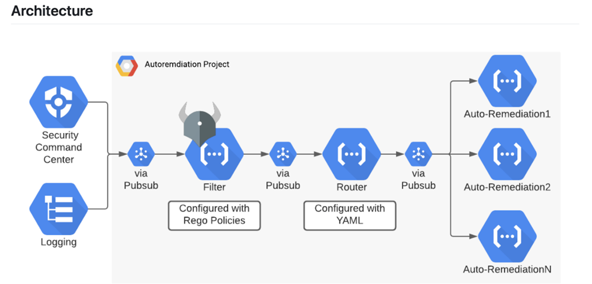

# Security Automation Terraform Project

This Terraform project automates the setup and configuration of security-related resources on Google Cloud Platform (GCP). The project includes configurations for network setup, firewall rules, multi-factor authentication (MFA), Identity Platform, and IAM policies.

## Prerequisites
- [Terraform](https://www.terraform.io/) installed locally.
- Appropriate access and permissions to create resources in GCP.

## Terraform Providers

### Provider Configuration

The `provider.tf` file specifies the GCP provider configuration:

```
provider "google" {
  project = "security-automation"
  region  = "us-central1"
  zone    = "us-central1-c"
}

```

## Network Configuration
### Firewall Rule and Network
The `network.tf` file defines a Google Compute Engine firewall rule and a network:

```
    resource "google_compute_firewall" "security-automation-fw" {
    # Firewall rule configuration...
    }

    resource "google_compute_network" "security-automation-network" {
    # Network configuration...
    }
```

`google_compute_firewall`: Defines a firewall rule allowing specified traffic.
`google_compute_network`: Creates a network named "security-automation-network."

## Internal Network Configuration
### Internal Network Firewall Rule

The `net_monitor.tf` file defines another Google Compute Engine network and a firewall rule for internal traffic:

```
    resource "google_compute_network" "internal_network" {
    # Internal network configuration...
    }

    resource "google_compute_firewall" "internal_firewall" {
    # Firewall rule for internal traffic...
    }

```

`google_compute_network`: Creates an internal network named "internal-network."
`google_compute_firewall`: Defines a firewall rule allowing internal traffic.

## Multi-Factor Authentication (MFA)

### GCP Project and Identity Toolkit Configuration
The `mfa.tf` file creates a GCP project, enables the Identity Toolkit API, and configures Identity Platform settings:

```
    resource "google_project" "security-automation" {
    # Project configuration...
    }

    resource "google_project_service" "identitytoolkit" {
    # Enables Identity Toolkit API...
    }

    resource "google_identity_platform_config" "default" {
    # Identity Platform configuration...
    }
```

`google_project`: Creates a GCP project with specified details.
`google_project_service`: Enables the Identity Toolkit API.
`google_identity_platform_config`: Configures Identity Platform settings.

## IAM Policies
### IAM Policies Overview

This section outlines the IAM policies configured for the GCP project:

`google_project_iam_policy`: Sets the IAM policy for the project.
`data "google_iam_policy"`: Retrieves the IAM policy for a specific role.
`google_project_iam_binding`: Adds additional members to a role.

The `iam.tf` file defines IAM policies for the GCP project:

```
    resource "google_project_iam_policy" "security-automation-iam" {
    # IAM policy for the project...
    }

    data "google_iam_policy" "admin" {
    # Data source to retrieve IAM policy...
    }

    resource "google_project_iam_binding" "prevent_privilege_escalation" {
    # Additional IAM binding for editor role...
    }

    resource "google_project_iam_policy" "security-automation-iam-external" {
    # IAM policy with conditions for limited-time users...
    }

    data "google_iam_policy" "external-users" {
    # Data source for IAM policy with conditions...
    }
```

###  Task
As a senior cloud engineer at a leading IT consulting company, I have been tasked with designing and implementing a comprehensive system for continuous monitoring and automated remediation of security and compliance issues across our cloud infrastructure.

- Our company's entire workload is hosted on a single major cloud provider platform, utilizing a range of cloud-managed services, including virtual machines, containers, databases, caches, and object storage. Our team consists of junior and senior developers, SREs, and cloud engineers, with automated deployments of code and infrastructure as code.

### Security Requirements

To ensure the security and integrity of our cloud resources, I have identified the following key requirements:

- Restrict administrative privileges to only a select few users.
- Ensure all cloud resources are internal-only and not exposed to the public internet.

### Monitoring and Remediation Requirements

The system I am designing must continuously monitor and automatically remediate the following security and compliance issues:

1. *Identity and Access Management (IAM) changes*: Detect and respond to IAM changes that result in privilege escalation, including changes to user and service account permissions, both internal and external.
2. *Publicly exposed resources*: Identify and remediate resources that are exposed to the public internet, ensuring that all cloud resources remain internal-only.
3. *Multi-Factor Authentication (MFA)*: Monitor and enforce MFA on all user accounts, ensuring that no users have MFA disabled.
4. *Internal networking changes*: Detect and respond to changes made to internal networking settings, ensuring that our cloud resources remain secure and compliant.

By implementing this system, I aim to ensure the security, integrity, and compliance of our cloud infrastructure, protecting our internal resources and data from unauthorized access and exposure.




1.	A finding is either generated from Security Command Center (and can also use Cloud Logging) and sent to a Pubsub topic
2.	The Filter Cloud Function first can optionally run the finding through a series of Rego policies ( defined policies)  that will automatically mark the finding as a false positive and auto-close it.
3.	If the finding isn’t valid for your environment, it is sent to the Router Function, which is configured by YAML to send the finding on to the correct auto-remediation function that you have enabled.
4.	The auto-remediation Cloud Functions then take action to fix the problem addressed with the finding.


### Identity and Access Management (IAM) Escalation:

### Use Case:
Remember, part of my tasked was creating a system of continuous monitoring and automated remediations that cover Identity and Access Management changes that result in privilege escalation. If A user accidentally grants excessive permissions to another user or service account, creating a privilege escalation risk.

### Automated Remediation:

- Script:I utilize a script that continuously monitors IAM events for specific actions like granting admin privileges. Upon detection, automatically revoke the excessive permissions and notify administrators.
- Cron job: I created a cron job that runs the script at regular ( 10 minute)intervals.
- Justification: My reasoning here is that, scripting allows for immediate mitigation of privilege escalation attempts, minimizing potential damage.

### Exposed Public Resources:

### Use Case:

A new resource is provisioned without proper security configurations, exposing it to the public internet.

### Automated Remediation:

- Terraform: Define templates with pre-configured security settings for common resource types. When a new resource is created, automatically deploy the associated template to enforce secure configurations.
- Justification: Templates ensure consistent security across all resources, preventing accidental misconfigurations.

### Missing Multi-Factor Authentication (MFA):

### Use Case:

Users haven't enabled MFA on their accounts, increasing the risk of unauthorized access.

### Conditional Access Policies:
Implement policies requiring MFA for all login attempts based on specific conditions like geographical location or login attempt time.
- Justification: Conditional access policies enforce MFA without impacting legitimate user access, improving security without unnecessary friction.

### Internal Network Changes:

### Use Case:
Unauthorized or risky changes are made to internal network configurations, potentially compromising security.

- Network Change Detection Tools: Deploy tools that monitor network configurations and alert on unauthorized changes. Additionally, leverage rollback functionalities to revert to previous configurations if needed.
- Justification: Monitoring and rollback capabilities ensure rapid detection and mitigation of risky network changes.

### Custom Remediation Example:

### Scenario:
A service account used for database backups accidentally acquires excessive permissions in IAM.

### Custom Script:
Develop a script that identifies service accounts with specific IAM roles, for example `iamcheck.py`, and limits permissions to predefined levels. Schedule regular execution of the script to maintain secure configurations.

Justification: This custom script addresses a specific risk not covered by other tools, ensuring service accounts operate with least privilege.
